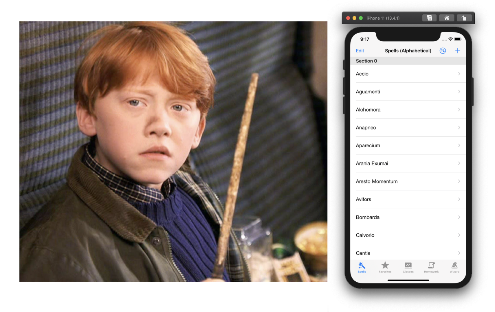

# SpellChecker

Ron Weasley decides to take his MacBook out and develop an app to impress Hermione Granger with his innate knowledge of spells. He wouldn't dare to develop it without automated tests, of course. Much less without BDD scenarios.

