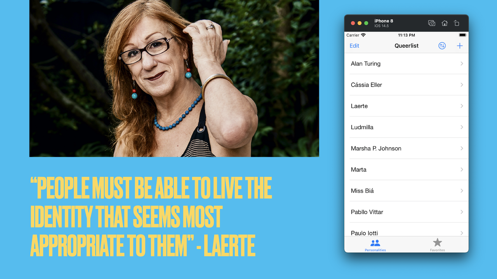
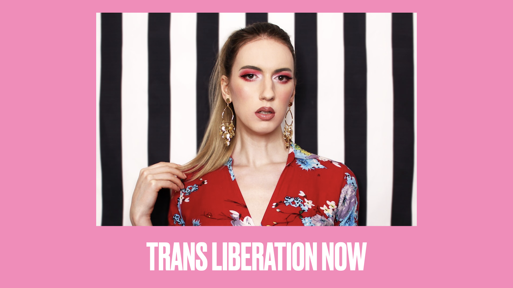

# Queerlist

This used to be a Harry Potter-themed project because I was a big fan of the series. In light of [the wizard's author endangering trans people's lives with her bigoted views](https://youtu.be/7gDKbT_l2us) (going as far as [using her wealth to do it](https://x.com/ThomasWillett9/status/1758951601991987294)), what you're going to find here is a collection of notable LGBTQIA+ personalities from Brasil and the US.

## Getting started

TBD

## FAQ

- **I noticed that Cucumberish hasn't been updated in a while. Why did you pick it instead of another solution like Quick?**

In plain terms, Cucumberish is the simplest, most direct implementation that I've found of BDD for iOS and I like it this way. Other solutions seem to structure things differently and I've elected to keep using Cucumberish, even with its annoyances, because of how straightforward it is when it comes to organizing test scenarios.

## Reference

Cucumberish, our framework of choice for parsing BDD Feature files: https://github.com/Ahmed-Ali/Cucumberish

A guide for the test scenario syntax supported by Cucumberish (Gherkin): https://cucumber.io/docs/gherkin/reference/ (Notice that this guide applies not only to Cucumberish but also to any other BDD framework used in conjunction with any other language - e.g., Java.)

## About this repo

Rafael C. Schmitt – [@mitt_rafael@toot.wales](https://toot.wales/@mitt_rafael)

Distributed under the MIT license. See ``LICENSE`` for more information.
